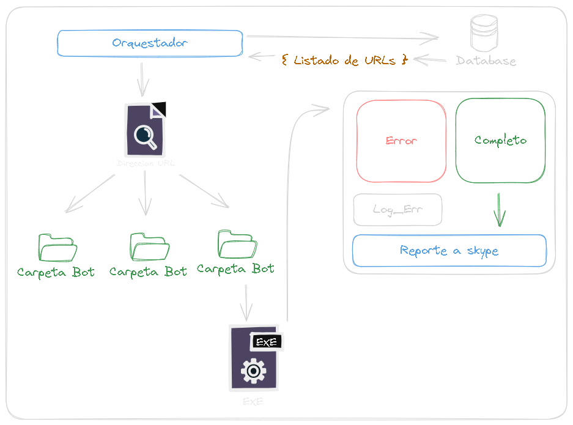

# Orquestador

Este es un programa de orquestación que permite crear y gestionar bots con tareas programadas. Utiliza la biblioteca `tkinter` para la interfaz gráfica, `sqlite3` para la base de datos y `subprocess` para ejecutar los bots en segundo plano.

## Funciones Principales

### `init_db()`
- Inicializa la base de datos SQLite llamada `Orquestador.db`.
- Crea las tablas `bots` y `logs` si no existen.
- Parámetros: No toma ningún parámetro.
   
### `nuevo_bot(cursor, container)`
- Agrega un nuevo bot a la base de datos con valores predeterminados.
- Actualiza la vista de la interfaz gráfica con el nuevo bot.

- Parámetros:
    - `cursor`: El cursor de la base de datos obtenido de `init_db()`.
    - `container`: El contenedor en la interfaz gráfica donde se mostrarán los botones de los bots.

### `getAll(cursor, container)`
- Recupera todos los datos de los bots desde la base de datos.
- Actualiza la vista de la interfaz gráfica con los bots existentes.

- Parámetros:
    - `cursor`: El cursor de la base de datos obtenido de init_db().
    - `container`: El contenedor en la interfaz gráfica donde se mostrarán los botones de los bots.

### `abrir_tarjeta(cursor, id, nombre_tarjeta, path_pred, intervalo_pred, status)`
- Abre una ventana para configurar un bot existente.
- Permite editar el nombre, la ruta del archivo ejecutable, el intervalo de ejecución, los días de la semana y el estado del bot.

- Parámetros:
    - `cursor`: El cursor de la base de datos obtenido de `init_db()`.
    - `id`: El identificador único del bot.
    - `nombre_tarjeta`: El nombre del bot.
    - `path_pred`: La ruta del archivo ejecutable del bot.
    - `intervalo_pred`: El intervalo de ejecución del bot en minutos.
    - `status`: El estado del bot (`activo` o `inactivo`).

### `seleccionar_archivo(campo_ruta_archivo)`
- Abre un cuadro de diálogo para seleccionar la ruta de un archivo ejecutable.

- Parámetros:
    - `campo_ruta_archivo`: El campo de entrada donde se mostrará la ruta del archivo ejecutable.

### `boton_correr(id, campo_ruta_archivo)`
- Ejecuta un bot en un hilo separado con la ruta del archivo ejecutable proporcionada.

- Parámetros:
    - `id`: El identificador único del bot.
    - `campo_ruta_archivo`: El campo de entrada que contiene la ruta del archivo ejecutable del bot.

### `ejecutar_bot_en_hilo(id, path)`
- Crea un hilo para ejecutar un bot con una ruta de archivo específica.

- Parámetros:
    - `id`: El identificador único del bot.
    - `path`: La ruta del archivo ejecutable del bot.

### `correr_bot(id, path)`
- Ejecuta el archivo ejecutable del bot y registra la hora de finalización en la base de datos.

- Parámetros:
    - `id`: El identificador único del bot.
    - `path`: La ruta del archivo ejecutable del bot.

### `actualizar_seleccion(lista_dias, dias_semana, valores)`
- Actualiza la selección de días de la semana en la interfaz gráfica.

- Parámetros:
    - `lista_dias`: La lista de días de la semana en la interfaz gráfica.
    - `dias_semana`: Una lista de nombres de días de la semana.
    - `valores`: Una lista de valores (`0` o `1`) que indican si un día está seleccionado o no.

### `calcular_diferencia_minutos(hora_definida, hora_actual)`
- Calcula la diferencia en minutos entre dos horas en formato "HH:MM:SS".

- Parámetros:
    - `hora_definida`: La hora en formato "HH:MM:SS" que se va a comparar.
    - `hora_actual`: La hora actual en formato "HH:MM:SS".

### `ejecutar_bot_programado()`
- Ejecuta los bots programados basados en su intervalo y hora definida.

### `auto_ejecucion()`
- Ejecuta el `ejecutar_bot_programado` en un bucle infinito para verificar la hora actual y ejecutar los bots según corresponda.

### `init_programacion_bots()`
- Inicializa la programación de bots llamando a `auto_ejecucion` en un hilo separado.

## Diagrama

## Interfaz Gráfica
- La interfaz permite crear, configurar y ejecutar bots.
- Cada bot tiene un nombre, una ruta de archivo ejecutable, un intervalo de ejecución, días de la semana y un estado (activo o inactivo).

## Ejecución Programada
- Los bots pueden programarse para ejecutarse a intervalos específicos y en días de la semana definidos.
- La ejecución programada se realiza en segundo plano.

## Base de Datos
- Utiliza una base de datos SQLite llamada `Orquestador.db` para almacenar información sobre los bots y sus ejecuciones.

Espero que esta documentación te sea útil. Si necesitas más detalles o aclaraciones sobre alguna parte del código, no dudes en preguntar.
